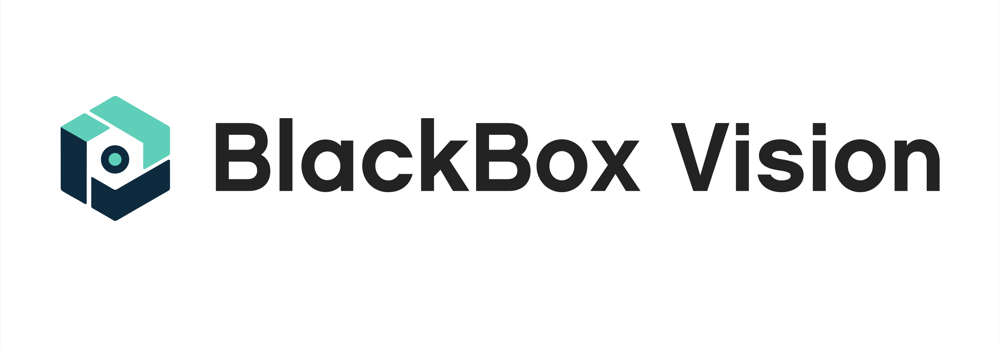

# BlackBox Vision Frontend Challenge ⚛️

QuizBox Vision is a question and answer game, like many others. There's much more at stake! Well, not really, but maybe it's good enough to hook you up.

The challenge is to build a web or mobile application, according to it convenient.
It depends on you define the solution and create the components required.

This is a game, so we expect your end-product to be both visually attractive and functionally effective.

## Table of Contents 🔎

- [Functional definitions](#functional-definitions)
- [Technical definitions](#technical-definitions)
- [Design](#design)
- [Acceptance criteria](#acceptance-criteria)
- [API documentation](#api-documentation)
- [Deploy](#deploy)
- [BlackBox Vision jobs](#bbv-careers-opportunities)

## Functional Definitions 📝

The game consists of 10 single (true/false) or multiple choice questions.

For each question, it is necessary to show the following fields:

- The question itself
- Category
- Difficulty
- Possible answers
- When selecting the answer, it shows if it was correct or not. It is not necessary to show which was the correct answer.

At the end of the game, the obtained score is displayed. It is calculated as follows:

- Correct answer (true / false): **5 points**
- Correct answer (multiple option): **10 points**
- Incorrect answer: **0 points**

## Technical Definitions 💻

- All necessary data for the game, are in the following API
- The game can be played in [React](https://reactjs.org/) web or [React Native](https://reactnative.dev/).
- Each question must be presented on a separate screen in the application.
- Use [Typescript](https://www.typescriptlang.org/) (with data types)

### Optionally

- _Jest + React Testing Library (testing)_

> You can use any additional library you need to carry out the challenge.

> We can be flexible if you feel comfortable with any other technology or if you want to combine them in different ways. You can use other stack like _CRA, NextJS, Remix, React Native, Heroku, Digital Ocean, etc..._

## Design 🎨

We suggest that you create your own design, it must be something that you think is appropriate for a game.

## Acceptance Criteria ✅

We will test the solution you make and evaluate the quality of the code.

We will see how the UI that you implemented interacts with different states and interactions that the user performs.

Most importantly, we hope you have fun while doing the challenge!

## API Documentation 📖

- Read our [API Documentation](https://opentdb.com/)

## Deploy 🚀

### If you choose Web
This needs to ship. You should upload the project to a public link (we recommend [Vercel](https://vercel.com/)). You should also upload it to Github so we can review the code.

In case you need a hand in getting your site to go live, we recommend you read the [Vercel Docs](https://vercel.com/docs/concepts/deployments/overview) to help you out.

Once your code is ready send the public link and repository link via email to whoever sent it to you from Aerolab, or you can apply at https://aerolab.co/jobs if you got here some other way.

### If you choose Mobile
In this case it's not necessary deploy anything. Only remember to share a `.env` file if you use it.

---

## About us 👥

BlackBox Vision is a Digital Products Agency based in Buenos Aires, Argentina.

We create digital experiences to make your idea come true.

We help startups and large companies to create experiences to connect with their users through the development of high-impact Digital Products.

Our goal is to find proactive, talented and passionate developers.

For us, this challenge is a fun way to reach out to developers and test their skills.

We believe in technology as a driver of change!

## BlackBox Vision jobs 

### 👩‍💻 Are your looking for a remote developer job?

We are open to work! We have remote positions for Frontend and Fullstack developers but also there are positions for Product Designers, Project Managers and more! Feel free to send an email to [jobs@blackbox-vision.tech](mailto:jobs@blackbox-vision.tech)

## Follow us!

Follow BlackBox Vision on social networks

- [Twitter](https://twitter.com/blackbox_vision)
- [Instagram](https://www.instagram.com/blackbox_vision/)
- [Linkedin](https://www.linkedin.com/company/blackbox-vision)

## About Us
- [Check out our blog](https://blog.blackbox-vision.tech/)
- [Check out our opensource projects](https://github.com/BlackBoxVision)
- [Visit our website](https://www.blackbox-vision.tech/)
